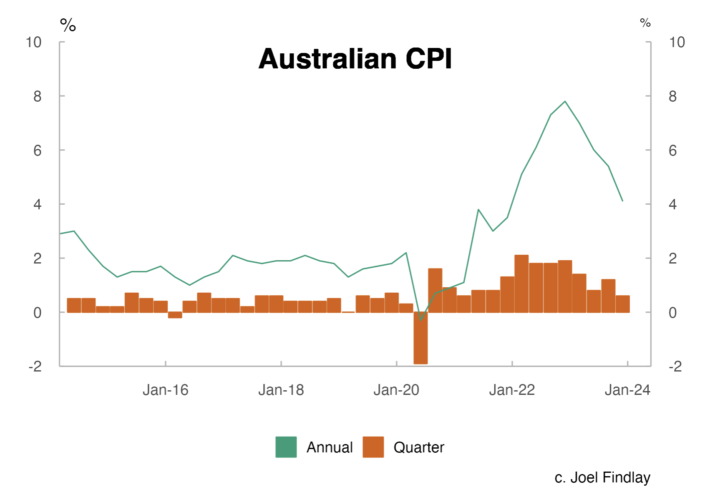

<!-- README.md is generated from README.Rmd. Please edit that file -->

# data viewer

{data_viewer} is a Shiny App which enable you to view offical data from
multiple sources, it also provides detiled breakdowns of Australian CPI
data.

This project is a work in progress.

<!-- ## Installation -->
<!-- You can install the development version of readAOFM from [GitHub](https://github.com/) with: -->
<!-- ``` r -->
<!-- # install.packages("devtools") -->
<!-- devtools::install_github("joel23978/readAOFMpackage") -->
<!-- ``` -->

## Example

What the app looks like:

``` r
library(here)
library(knitr)
knitr::include_graphics(here("doco", "example_1.png"))
```


We can (fairly trivially) make charts like the following:

``` r
knitr::include_graphics(here("doco", "example_2.png"))
```



And the CPI-specific tab:

``` r
knitr::include_graphics(here("doco", "example_3.png"))
```


Note: Items preceeded by an ‘x’ in the ui have not been implmented.
