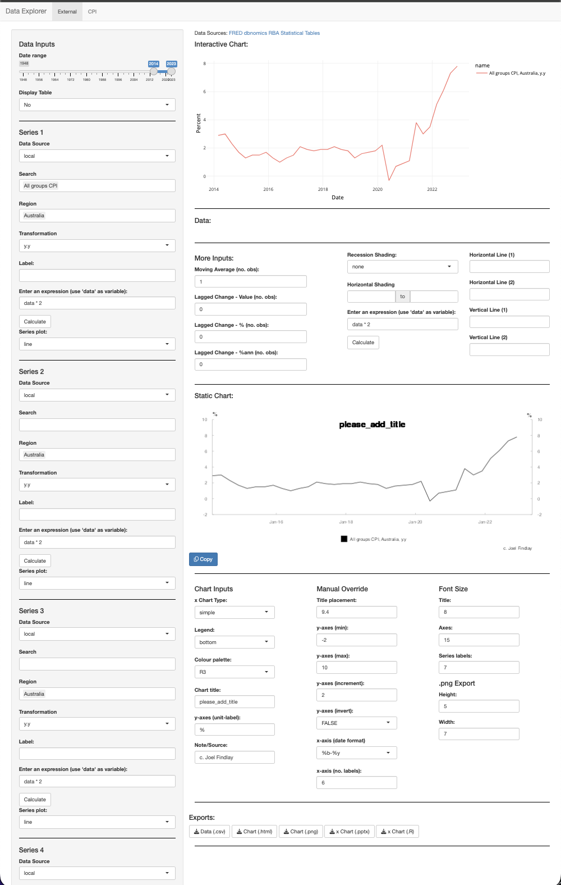
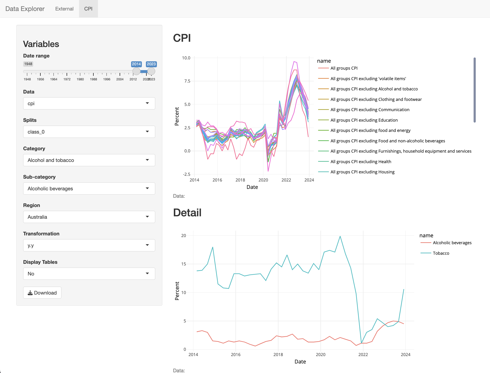

<!-- README.md is generated from README.Rmd. Please edit that file -->

# data viewer

{data_viewer} is a Shiny App which enable you to view offical data from
multiple sources, it also provides detailed breakdowns of Australian CPI
data.

This project is a work in progress.

The app currently allows you to pull data from FRED, dbnomics, the RBA
(using readrba), the ABS (using readabs) and bloomberg (assuming you
have access to a terminal).

Note: The app works best in chrome (other browsers may not allow for
copying charts to clipboard).

<!-- ## Installation -->
<!-- You can install the development version of readAOFM from [GitHub](https://github.com/) with: -->
<!-- ``` r -->
<!-- # install.packages("devtools") -->
<!-- devtools::install_github("joel23978/readAOFMpackage") -->
<!-- ``` -->

## Example

What the app looks like:

``` r
library(here)
library(knitr)
knitr::include_graphics(here("doco", "example_1.png"))
```



We can (fairly trivially) make charts like the following:

``` r
knitr::include_graphics(here("doco", "Australian CPI.png"))
```


and like this (using RBA data):

``` r
knitr::include_graphics(here("doco", "Australian Dollar Exchange Rates.png"))
```


and this (using abs data):

``` r
knitr::include_graphics(here("doco", "Housing Finance_ New Loan Commitments.png"))
```


And the CPI-specific tab:

``` r
knitr::include_graphics(here("doco", "example_3.png"))
```



Note: Items preceeded by an ‘x’ in the ui have not been implmented.
